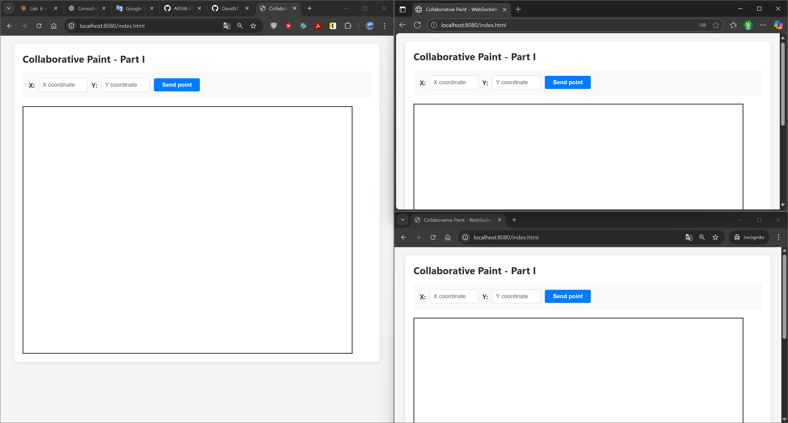

# 🎨 WebSockets STOMP - Collaborative Paint Application (ARSW)

## 👥 **Team Members**

- [Jesús Alfonso Pinzón Vega](https://github.com/JAPV-X2612)
- [David Felipe Velásquez Contreras](https://github.com/DavidVCAI)

---

## 📚 **Laboratory Overview**

This laboratory implements a **real-time collaborative drawing application** using **WebSockets**, **STOMP protocol**, and **HTML5 Canvas**. The system enables multiple users to draw simultaneously on shared canvases while maintaining independent drawing sessions through dynamic topic management.

### 🎯 **Learning Objectives**

- ✅ Understanding **WebSocket protocol** for real-time bidirectional communication
- ✅ Implementing **STOMP messaging** over WebSockets with Spring Boot
- ✅ Managing **dynamic topic subscriptions** for multi-session support
- ✅ Building **interactive HTML5 Canvas** applications
- ✅ Handling **concurrent server-side processing** with thread-safe collections
- ✅ Creating **collaborative polygon drawing** with point accumulation
- ✅ Implementing **SockJS fallback** for cross-browser compatibility
- ✅ Applying **message broker patterns** for event propagation

---

## 🏗️ **Architecture Overview**

### 📋 **System Architecture - Parts I-III**

```
┌────────────────────────────────────────────┐
│         Paint Client (Browser)             │
│  ┌──────────────────────────────────────┐  │
│  │         HTML5 Canvas                 │  │
│  │    (Interactive Drawing Area)        │  │
│  └──────────────────────────────────────┘  │
│                   │                        │
│                   ▼                        │
│  ┌──────────────────────────────────────┐  │
│  │        JavaScript (app.js)           │  │
│  │  - WebSocket Connection              │  │
│  │  - STOMP Client                      │  │
│  │  - Canvas Event Handlers             │  │
│  │  - Dynamic Topic Subscription        │  │
│  └──────────────────────────────────────┘  │
│                   │                        │
│                   │ STOMP over WebSocket   │
└───────────────────┼────────────────────────┘
                    │
                    ▼
┌────────────────────────────────────────────┐
│      Spring Boot WebSocket Server          │
│  ┌──────────────────────────────────────┐  │
│  │   CollabPaintWebSocketConfig         │  │
│  │  - STOMP Endpoint: /stompendpoint    │  │
│  │  - Message Broker: /topic            │  │
│  │  - SockJS Fallback Support           │  │
│  └──────────────────────────────────────┘  │
│                   │                        │
│                   ▼                        │
│  ┌──────────────────────────────────────┐  │
│  │    Simple In-Memory Broker           │  │
│  │  Topic: /topic/newpoint.{drawingId}  │  │
│  │  (Broadcasts to all subscribers)     │  │
│  └──────────────────────────────────────┘  │
└────────────────────────────────────────────┘
```

### 📊 **Activity Diagram - Part I-III**


**Flow Description (Parts I-III):**
1. **Mouse Click Event** → Client captures canvas coordinates
2. **Signal Sending** → Point published to `/topic/newpoint.{drawingId}`
3. **Signal Receipt** → All subscribed clients receive the point
4. **Draw Point** → Point rendered on each client's canvas

---

### 📋 **Enhanced Architecture - Part IV**

```
┌────────────────────────────────────────────┐
│         Paint Client (Browser)             │
│  ┌──────────────────────────────────────┐  │
│  │         HTML5 Canvas                 │  │
│  │  - Points (individual dots)          │  │
│  │  - Polygons (filled shapes)          │  │
│  └──────────────────────────────────────┘  │
│                   │                        │
│                   ▼                        │
│  ┌──────────────────────────────────────┐  │
│  │        JavaScript (app.js)           │  │
│  │  Subscribe to:                       │  │
│  │    • /topic/newpoint.{id}            │  │
│  │    • /topic/newpolygon.{id}          │  │
│  │  Publish to:                         │  │
│  │    • /app/newpoint.{id}              │  │
│  └──────────────────────────────────────┘  │
└───────────────────┼────────────────────────┘
                    │ STOMP over WebSocket
                    ▼
┌────────────────────────────────────────────┐
│      Spring Boot WebSocket Server          │
│  ┌──────────────────────────────────────┐  │
│  │    STOMPMessagesHandler              │  │
│  │      (@Controller)                   │  │
│  │                                      │  │
│  │  @MessageMapping("/newpoint.{id}")   │  │
│  │  ┌────────────────────────────────┐  │  │
│  │  │  1. Receive Point              │  │  │
│  │  │  2. Store in ConcurrentHashMap │  │  │
│  │  │  3. Broadcast to /topic/       │  │  │
│  │  │     newpoint.{id}              │  │  │
│  │  │  4. Check if 4 points complete │  │  │
│  │  │  5. If yes: Create Polygon     │  │  │
│  │  │  6. Broadcast to /topic/       │  │  │
│  │  │     newpolygon.{id}            │  │  │
│  │  │  7. Reset point accumulator    │  │  │
│  │  └────────────────────────────────┘  │  │
│  └──────────────────────────────────────┘  │
│                   │                        │
│                   ▼                        │
│  ┌──────────────────────────────────────┐  │
│  │    Thread-Safe Point Storage         │  │
│  │  ConcurrentHashMap<String, List>     │  │
│  │  Key: drawingId                      │  │
│  │  Value: CopyOnWriteArrayList<Point>  │  │
│  └──────────────────────────────────────┘  │
└────────────────────────────────────────────┘
```

### 📊 **Activity Diagram - Part IV**


**Enhanced Flow Description (Part IV):**
1. **Mouse Click** → Point sent to `/app/newpoint.{id}` (intercepted by server)
2. **Server Processing** → Point stored in thread-safe collection
3. **Point Broadcast** → Server forwards to `/topic/newpoint.{id}`
4. **Draw Point** → All clients render the point
5. **Polygon Check** → Server checks if 4+ points accumulated
6. **Polygon Broadcast** → If complete, server sends to `/topic/newpolygon.{id}`
7. **Draw Polygon** → All clients render filled polygon
8. **Reset** → Server clears point accumulator for next polygon

---

## ⚙️ **Prerequisites & Setup**

### 🔧 **Technologies Used**

**Backend:**
- *Java 17*
- *Spring Boot 2.7.18*
- *Spring WebSocket*
- *STOMP Protocol*
- *SockJS 1.5.1*
- *Maven 3.6+*

**Frontend:**
- *HTML5 Canvas API*
- *JavaScript ES6+*
- *STOMP WebSocket Client 2.3.4*
- *jQuery 3.7.1*

### 📦 **Dependencies Configuration**

**Key Maven Dependencies:**

```xml
<!-- WebSocket Support -->
<dependency>
    <groupId>org.springframework.boot</groupId>
    <artifactId>spring-boot-starter-websocket</artifactId>
</dependency>

<!-- SockJS WebJar -->
<dependency>
    <groupId>org.webjars</groupId>
    <artifactId>sockjs-client</artifactId>
    <version>1.5.1</version>
</dependency>

<!-- STOMP WebSocket WebJar -->
<dependency>
    <groupId>org.webjars</groupId>
    <artifactId>stomp-websocket</artifactId>
    <version>2.3.4</version>
</dependency>
```

### 🚀 **Running the Application**

**Compilation and Execution Commands:**

```bash
# Navigate to project directory
cd LAB7-HTML5_JS_STOMP_WebSockets

# Clean and compile
mvn clean compile

# Run the application
mvn spring-boot:run

# Access the application
# Open browser at: http://localhost:8080
```

**Expected Output:**
```
Started CollabPaintApplication in X.XXX seconds
Tomcat started on port(s): 8080 (http)
```

---

## 📂 **Project Structure**

```
LAB7-HTML5_JS_STOMP_WebSockets/
├── src/main/
│   ├── java/edu/eci/arsw/collabpaint/
│   │   ├── CollabPaintApplication.java          ← Main Spring Boot app
│   │   ├── CollabPaintWebSocketConfig.java      ← WebSocket configuration
│   │   ├── STOMPMessagesHandler.java            ← STOMP message controller (Part IV)
│   │   └── model/
│   │       ├── Point.java                       ← Point model
│   │       └── Polygon.java                     ← Polygon model (Part IV)
│   └── resources/
│       ├── static/
│       │   ├── index.html                       ← Main UI
│       │   ├── app.js                           ← Client-side logic
│       │   └── styles.css                       ← Styling
│       └── application.properties
├── pom.xml
└── README.md
```

---

## 🎯 **Implementation Details**

### 📋 **Part I: Basic Point Broadcasting**

#### 🎨 **Initial Interface**


**Objective:** Implement basic WebSocket communication for point broadcasting.

**Key Implementation:**

**Frontend (app.js):**
```javascript
// Publish point to topic
var topic = '/topic/newpoint';
stompClient.send(topic, {}, JSON.stringify({x: 10, y: 10}));

// Subscribe to topic
stompClient.subscribe('/topic/newpoint', function(eventbody) {
    var point = JSON.parse(eventbody.body);
    alert('Point received: ' + JSON.stringify(point));
});
```

**Verification Steps:**
1. Open application in multiple browser tabs
2. Enter X and Y coordinates
3. Click "Send point" button
4. Verify alert appears in all tabs with same coordinates

**Console Logs:**


**Alert Received:**


**Multiple Tabs Test:**



---

### 📋 **Part II: Canvas Drawing Integration**

#### 🖌️ **Canvas Interface**


**Objective:** Replace alerts with actual canvas drawing using mouse events.

**Key Implementation:**

**Canvas Event Handling:**
```javascript
canvas.addEventListener('click', function(event) {
    var rect = canvas.getBoundingClientRect();
    var x = event.clientX - rect.left;
    var y = event.clientY - rect.top;
    
    var pt = new Point(Math.round(x), Math.round(y));
    
    // Draw locally
    addPointToCanvas(pt);
    
    // Broadcast to others
    stompClient.send('/topic/newpoint', {}, JSON.stringify(pt));
});
```

**Drawing Function:**
```javascript
var addPointToCanvas = function(point) {
    var canvas = document.getElementById("canvas");
    var ctx = canvas.getContext("2d");
    ctx.beginPath();
    ctx.arc(point.x, point.y, 3, 0, 2 * Math.PI);
    ctx.fillStyle = "#000000";
    ctx.fill();
    ctx.stroke();
};
```

**Points Drawn:**


**Collaborative Drawing:**


**Console Events:**


**Multiple Browsers Test:**


**Real-Time Synchronization:**


---

### 📋 **Part III: Dynamic Topics for Multiple Drawings**

#### 🔌 **Connection Panel**


**Objective:** Support multiple independent drawing sessions with dynamic topic management.

**Key Features:**
- Manual connection with drawing ID selection
- Dynamic topic subscription: `/topic/newpoint.{drawingId}`
- Independent drawings per session

**Enhanced Implementation:**

**Connection Management:**
```javascript
var connectAndSubscribe = function(drawingId) {
    var socket = new SockJS('/stompendpoint');
    stompClient = Stomp.over(socket);
    
    stompClient.connect({}, function(frame) {
        currentDrawingId = drawingId;
        
        // Subscribe to dynamic topic
        var topic = '/topic/newpoint.' + drawingId;
        stompClient.subscribe(topic, function(eventbody) {
            var point = JSON.parse(eventbody.body);
            addPointToCanvas(point);
        });
    });
};
```

**Publishing to Dynamic Topics:**
```javascript
canvas.addEventListener('click', function(event) {
    var position = getMousePosition(event);
    var pt = new Point(position.x, position.y);
    
    // Publish to specific drawing topic
    var topic = '/topic/newpoint.' + currentDrawingId;
    stompClient.send(topic, {}, JSON.stringify(pt));
});
```

**Drawing #25 Connected:**


**Drawing #80 Connected:**


**Independent Drawings:**


**Multiple Clients Same Drawing:**


**Console Dynamic Topics:**


---

### 📋 **Part IV: Server-Side Processing & Polygon Drawing**

#### 🔷 **Architecture Enhancement**

**Objective:** Implement server-side point accumulation and automatic polygon generation.

**New Model Class (Polygon.java):**

```java
package edu.eci.arsw.collabpaint.model;

import java.util.List;

/**
 * Represents a polygon composed of multiple points.
 *
 * @author Jesús Pinzón & David Velásquez
 * @version 1.0
 * @since 2025-10-17
 */
public class Polygon {
    
    private List<Point> points;

    public Polygon() {
    }

    public Polygon(List<Point> points) {
        this.points = points;
    }

    public List<Point> getPoints() {
        return points;
    }

    public void setPoints(List<Point> points) {
        this.points = points;
    }

    @Override
    public String toString() {
        return "Polygon{points=" + points.size() + '}';
    }
}
```

**STOMP Message Handler (STOMPMessagesHandler.java):**

```java
package edu.eci.arsw.collabpaint;

import edu.eci.arsw.collabpaint.model.Point;
import edu.eci.arsw.collabpaint.model.Polygon;
import org.springframework.beans.factory.annotation.Autowired;
import org.springframework.messaging.handler.annotation.DestinationVariable;
import org.springframework.messaging.handler.annotation.MessageMapping;
import org.springframework.messaging.simp.SimpMessagingTemplate;
import org.springframework.stereotype.Controller;

import java.util.List;
import java.util.Map;
import java.util.concurrent.ConcurrentHashMap;
import java.util.concurrent.CopyOnWriteArrayList;

/**
 * STOMP message handler for processing collaborative drawing events.
 * Manages point accumulation and polygon generation per drawing session.
 *
 * @author Jesús Pinzón & David Velásquez
 * @version 1.0
 * @since 2025-10-17
 */
@Controller
public class STOMPMessagesHandler {

    @Autowired
    private SimpMessagingTemplate msgt;

    /**
     * Thread-safe storage for accumulated points per drawing.
     * Key: drawingId
     * Value: List of points (thread-safe)
     */
    private final Map<String, List<Point>> drawingPoints = new ConcurrentHashMap<>();

    /**
     * Minimum number of points required to form a polygon.
     */
    private static final int POLYGON_POINT_THRESHOLD = 4;

    /**
     * Handles incoming points from clients.
     * Accumulates points and triggers polygon creation when threshold is reached.
     *
     * @param pt the received point
     * @param numdibujo the drawing identifier
     */
    @MessageMapping("/newpoint.{numdibujo}")
    public void handlePointEvent(Point pt, @DestinationVariable String numdibujo) {
        System.out.println("Point received on server for drawing " + numdibujo + ": " + pt);

        // Broadcast point to all clients subscribed to this drawing
        msgt.convertAndSend("/topic/newpoint." + numdibujo, pt);

        // Get or create point list for this drawing (thread-safe)
        List<Point> points = drawingPoints.computeIfAbsent(
            numdibujo, 
            k -> new CopyOnWriteArrayList<>()
        );

        // Add point to accumulator
        points.add(pt);

        System.out.println("Drawing " + numdibujo + " now has " + points.size() + " points");

        // Check if we have enough points to create a polygon
        if (points.size() >= POLYGON_POINT_THRESHOLD) {
            System.out.println("Polygon complete for drawing " + numdibujo + "! Creating polygon...");

            // Create polygon from accumulated points
            Polygon polygon = new Polygon(List.copyOf(points));

            // Broadcast polygon to all clients
            msgt.convertAndSend("/topic/newpolygon." + numdibujo, polygon);

            // Clear points for next polygon
            points.clear();

            System.out.println("Polygon sent and points reset for drawing " + numdibujo);
        }
    }
}
```

**Key Implementation Features:**

1. **Thread-Safe Collections:**
   - `ConcurrentHashMap` for managing multiple drawings
   - `CopyOnWriteArrayList` for point accumulation per drawing

2. **Point Accumulation Logic:**
   - Server intercepts points sent to `/app/newpoint.{id}`
   - Stores points in memory per drawing session
   - Forwards each point to `/topic/newpoint.{id}` for real-time drawing

3. **Polygon Generation:**
   - Automatically creates polygon when 4+ points accumulated
   - Publishes polygon to `/topic/newpolygon.{id}`
   - Resets accumulator for next polygon

**Client-Side Polygon Drawing (app.js):**

```javascript
// Subscribe to polygon topic
stompClient.subscribe('/topic/newpolygon.' + drawingId, function(eventbody) {
    console.log('Polygon received:', eventbody.body);
    var polygon = JSON.parse(eventbody.body);
    drawPolygon(polygon);
});

// Draw filled polygon on canvas
var drawPolygon = function(polygon) {
    var canvas = document.getElementById("canvas");
    var ctx = canvas.getContext("2d");
    
    if (!polygon.points || polygon.points.length < 3) return;
    
    ctx.beginPath();
    ctx.moveTo(polygon.points[0].x, polygon.points[0].y);
    
    for (var i = 1; i < polygon.points.length; i++) {
        ctx.lineTo(polygon.points[i].x, polygon.points[i].y);
    }
    
    ctx.closePath();
    ctx.fillStyle = "rgba(0, 123, 255, 0.3)";
    ctx.fill();
    ctx.strokeStyle = "#007bff";
    ctx.lineWidth = 2;
    ctx.stroke();
};
```

**Client Changes for Part IV:**
```javascript
// Changed: Publish to /app instead of /topic
var topic = '/app/newpoint.' + currentDrawingId;  // Server intercepts this
stompClient.send(topic, {}, JSON.stringify(pt));

// Added: Subscribe to polygon topic
var polygonTopic = '/topic/newpolygon.' + drawingId;
stompClient.subscribe(polygonTopic, function(eventbody) {
    var polygon = JSON.parse(eventbody.body);
    drawPolygon(polygon);
});
```

**Single Drawing Polygon:**


**Multiple Drawings with Polygons:**


**Server Console Logs:**


**Example Server Output:**
```
Point received on server for drawing 25: Point{x=150, y=200}
Drawing 25 now has 1 points
Point received on server for drawing 25: Point{x=300, y=200}
Drawing 25 now has 2 points
Point received on server for drawing 25: Point{x=300, y=400}
Drawing 25 now has 3 points
Point received on server for drawing 25: Point{x=150, y=400}
Drawing 25 now has 4 points
Polygon complete for drawing 25! Creating polygon...
Polygon sent and points reset for drawing 25
```

---

## 🔍 **Testing & Verification**

### ✅ **Part I Testing**

**Test Case 1: Basic Message Broadcasting**
- Open 3 browser tabs
- Enter coordinates (X=100, Y=150) in tab 1
- Click "Send point"
- **Expected:** Alert appears in all 3 tabs with coordinates

**Test Case 2: JSON Serialization**
- Verify console shows proper JSON format
- Confirm `JSON.parse()` works correctly

---

### ✅ **Part II Testing**

**Test Case 3: Canvas Click Events**
- Click anywhere on canvas
- **Expected:** Small black circle appears at click location
- Verify point coordinates in console

**Test Case 4: Cross-Browser Synchronization**
- Open app in Chrome and Firefox simultaneously
- Draw points in Chrome
- **Expected:** Points appear in real-time on Firefox canvas

---

### ✅ **Part III Testing**

**Test Case 5: Multiple Independent Drawings**
- Tab 1: Connect to Drawing #25
- Tab 2: Connect to Drawing #80
- Draw points in both
- **Expected:** Drawings remain completely independent

**Test Case 6: Multiple Clients Same Drawing**
- 3 clients connect to Drawing #25
- Each client draws different points
- **Expected:** All points visible on all clients

**Test Case 7: Dynamic Topic Verification**
- Check console logs
- Verify subscription to `/topic/newpoint.25`
- Verify publications to same dynamic topic

---

### ✅ **Part IV Testing**

**Test Case 8: Single Drawing Polygon**
- Connect to Drawing #1
- Draw exactly 4 points
- **Expected:** 
  - 4 individual points visible
  - Filled polygon appears connecting all points
  - Console shows polygon creation message

**Test Case 9: Multiple Drawings with Polygons**
- Client A: Connect to Drawing #10, draw 4 points
- Client B: Connect to Drawing #20, draw 4 points
- **Expected:**
  - Each drawing creates independent polygon
  - No cross-contamination between drawings

**Test Case 10: Continuous Polygon Generation**
- Connect to Drawing #5
- Draw 8 points (should create 2 polygons)
- **Expected:**
  - First polygon after points 1-4
  - Second polygon after points 5-8

**Test Case 11: Concurrent Access**
- 3 clients connect to Drawing #50
- All clients draw points simultaneously
- **Expected:**
  - Server correctly accumulates all points
  - Polygon generated at 4th point
  - All clients see same polygon

**Test Case 12: Server Console Verification**
- Monitor server console during testing
- **Expected output pattern:**
```
Point received on server for drawing X: Point{x=..., y=...}
Drawing X now has N points
[After 4th point]
Polygon complete for drawing X! Creating polygon...
Polygon sent and points reset for drawing X
```

---

## 📊 **Key Features Implemented**

### ✅ **WebSocket Communication**
- **Bidirectional real-time messaging** with STOMP protocol
- **SockJS fallback** for browsers without native WebSocket support
- **Connection state management** with UI feedback
- **Error handling** for connection failures

### ✅ **Dynamic Topic Management**
- **Per-drawing topic isolation**: `/topic/newpoint.{id}`
- **Manual connection workflow** with drawing ID selection
- **Multiple concurrent sessions** without interference
- **Topic-based message routing** for scalability

### ✅ **Canvas Drawing**
- **Interactive HTML5 Canvas** with mouse/pointer events
- **Real-time point rendering** with circle markers
- **Polygon rendering** with filled shapes and borders
- **Cross-platform event handling** (mouse + pointer API)

### ✅ **Server-Side Processing**
- **Message interception** via `@MessageMapping`
- **Point accumulation** with thread-safe collections
- **Automatic polygon generation** at 4-point threshold
- **Multi-drawing concurrency** with `ConcurrentHashMap`
- **Atomic operations** preventing race conditions

### ✅ **Thread Safety**
- **ConcurrentHashMap** for drawing session management
- **CopyOnWriteArrayList** for point accumulation
- **No synchronized blocks** (lock-free design)
- **Race condition prevention** with concurrent collections

---

## 🏆 **Evaluation Criteria Met**

### ✅ **Criterion 1: Single Drawing Point Propagation**
- ✅ Points propagate correctly between all open instances
- ✅ Real-time synchronization without delays
- ✅ Accurate coordinate transmission

### ✅ **Criterion 2: Multiple Drawing Point Propagation**
- ✅ Independent drawings work simultaneously
- ✅ No cross-talk between different drawing IDs
- ✅ Dynamic topic management functional

### ✅ **Criterion 3: Collaborative Polygon Creation**
- ✅ Polygon event propagates when 4 points inserted
- ✅ All clients render the polygon correctly
- ✅ Server correctly accumulates and resets points

### ✅ **Criterion 4: Concurrent Multiple Drawings with Polygons**
- ✅ 2+ drawings create polygons simultaneously
- ✅ Server maintains independent state per drawing
- ✅ No data corruption between sessions

### ✅ **Criterion 5: Concurrency Handling**
- ✅ Thread-safe collections used (`ConcurrentHashMap`, `CopyOnWriteArrayList`)
- ✅ No race conditions in point accumulation
- ✅ Atomic operations for polygon generation
- ✅ Proper concurrent session management

---

## 🔗 **Additional Resources**

### 📚 **Documentation & References**

**Spring WebSocket:**
- [Spring WebSocket Documentation](https://docs.spring.io/spring-framework/docs/current/reference/html/web.html#websocket)
- [STOMP Protocol Specification](https://stomp.github.io/)
- [Spring Boot WebSocket Guide](https://spring.io/guides/gs/messaging-stomp-websocket/)

**HTML5 Canvas:**
- [MDN Canvas Tutorial](https://developer.mozilla.org/en-US/docs/Web/API/Canvas_API/Tutorial)
- [HTML5 Canvas Deep Dive](https://www.html5canvastutorials.com/)

**JavaScript Concurrency:**
- [Web Workers API](https://developer.mozilla.org/en-US/docs/Web/API/Web_Workers_API)
- [JavaScript Promises](https://developer.mozilla.org/en-US/docs/Web/JavaScript/Reference/Global_Objects/Promise)

**Java Concurrency:**
- [Java Concurrent Collections](https://docs.oracle.com/javase/8/docs/api/java/util/concurrent/package-summary.html)
- [ConcurrentHashMap Guide](https://www.baeldung.com/java-concurrent-map)

---

## 📝 **Conclusion**

This laboratory successfully demonstrates the implementation of a **production-ready real-time collaborative application** using modern web technologies.

**© 2025 - Arquitecturas de Software (ARSW) - Escuela Colombiana de Ingeniería Julio Garavito**
